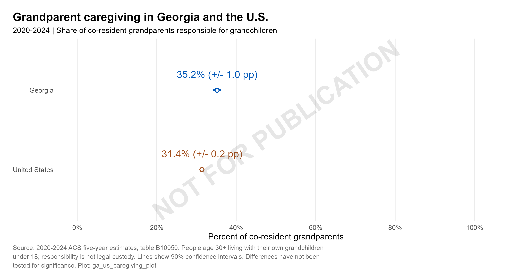
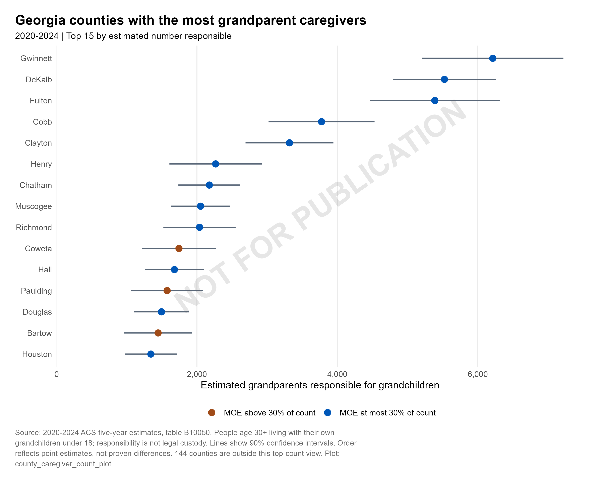
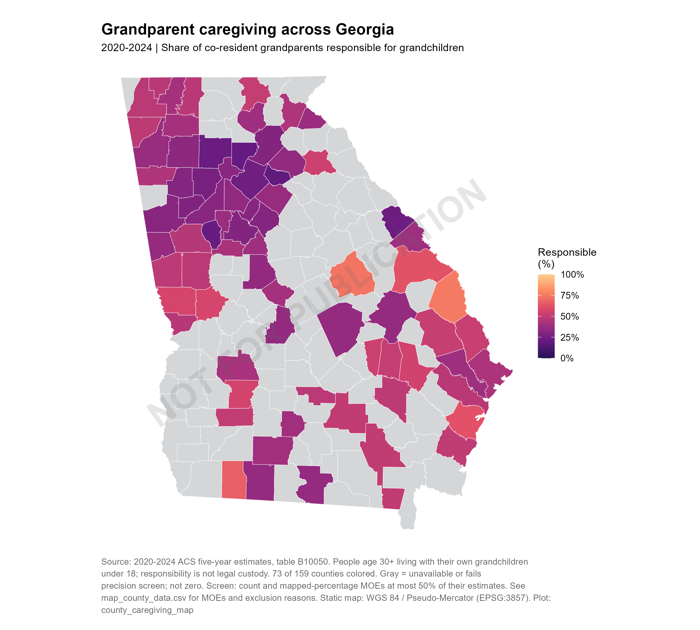
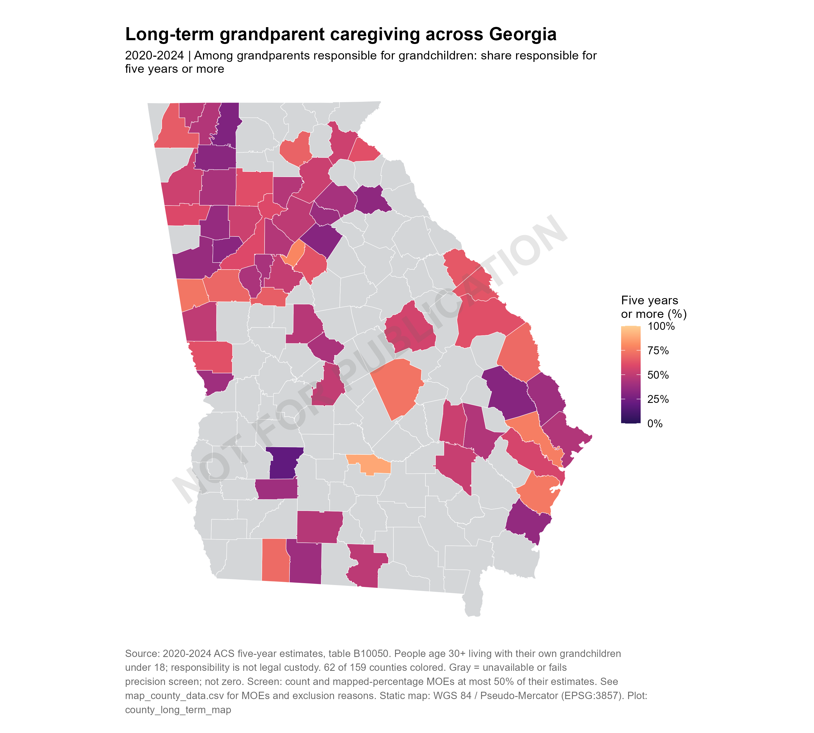
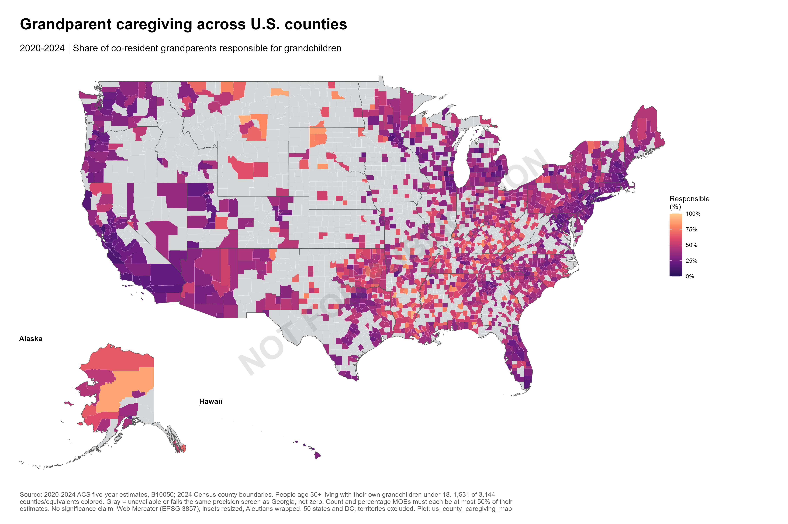
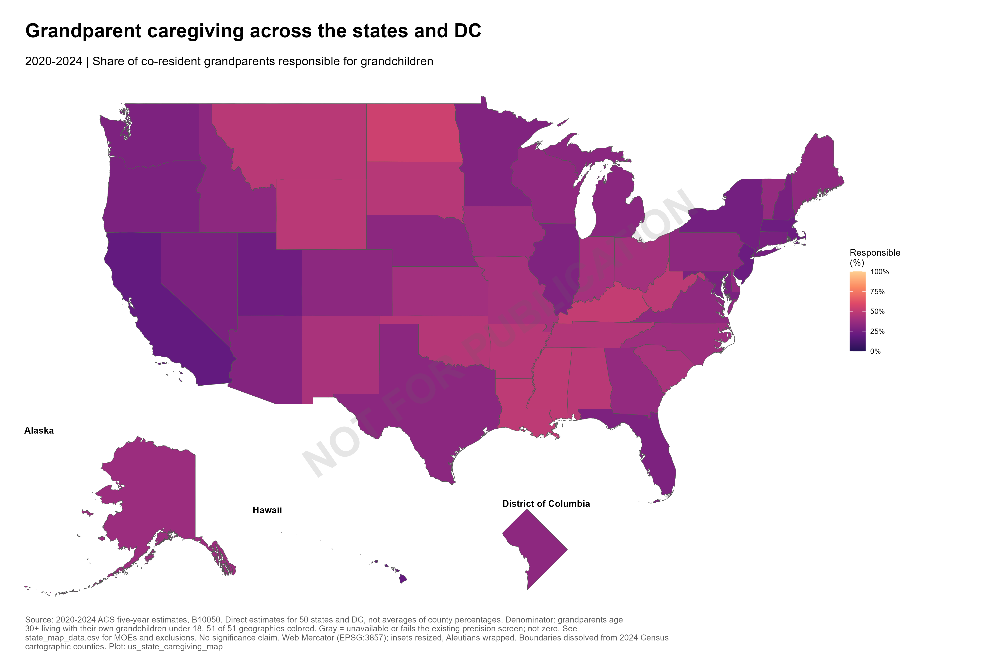

# Grandparent caregiving: review graphics

**NOT FOR PUBLICATION**

2020-2024 ACS five-year estimates. Charts show uncertainty; gray map counties are excluded, not zero.

See [graphics notes](../../docs/graphics_notes.md) for definitions, uncertainty and handoff instructions.

